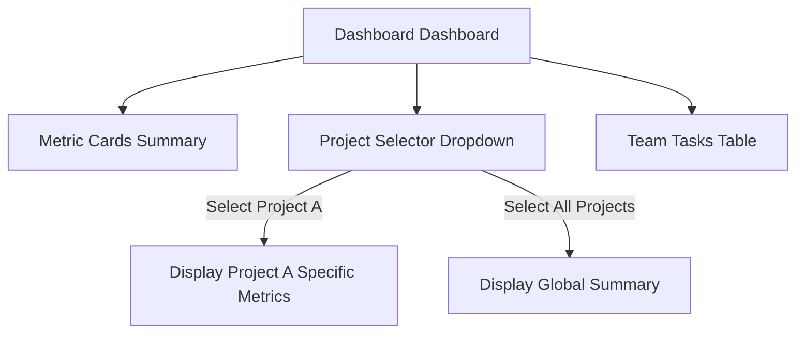
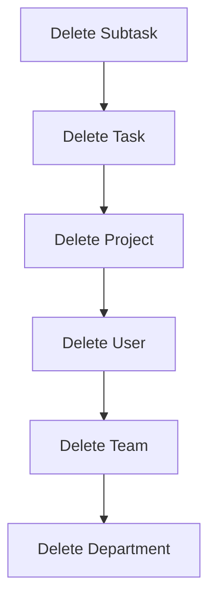

# NextGen Task Manager: User Manual & FAQ

Welcome to the **NextGen Task Manager**! This manual provides step-by-step guidance on how to navigate, operate, and utilize all key functional modules within the application. Designed for speed, responsiveness, and absolute control, this system provides powerful tools for team coordination, resource tracking, and high-performance task management.

> [!NOTE]
> All steps described below are optimized for NextGen Task Manager's unified design system. No sensitive backend API routing paths or underlying infrastructure details are exposed in this document.

---

## Table of Contents
1. [Landing Page & Authentication](#1-landing-page--authentication)
2. [Unified Command Center: Dashboard](#2-unified-command-center-dashboard)
3. [User & Organizational Directory Management](#3-user--organizational-directory-management)
4. [Project & Milestone Management](#4-project--milestone-management)
5. [Task & Subtask Lifecycle Management](#5-task--subtask-lifecycle-management)
6. [Interactive Kanban Board](#6-interactive-kanban-board)
7. [Focus Mode Panel](#7-focus-mode-panel)
8. [Resource Allocation & Team Workload](#8-resource-allocation--team-workload)
9. [Enterprise Analytics & Visual BI](#9-enterprise-analytics--visual-bi)
10. [Personal Settings & Profile Customization (Detailed)](#10-personal-settings--profile-customization-detailed)
11. [Data Cleanup: Safe Deletion Workflows](#11-data-cleanup-safe-deletion-workflows)
12. [Frequently Asked Questions (FAQ)](#12-frequently-asked-questions-faq)

---

## 1. Landing Page & Authentication

### A. Navigating the Public Space
The public space of NextGen Task Manager consists of three core pages:
*   **Product Page (Landing):** Highlighting the core marketing assets, dark/light compatibility, sleek gradients, and responsiveness.
*   **Signup Page:** Allows new users to easily register by entering their details.
*   **Login Page:** Secured gate where registered users can input their email and password.

### B. Standard Login Workflow
To log in as a designated administrator or team manager:
1. Direct your browser to the NextGen Task Manager web application.
2. Click **Login** on the top navigation header.
3. Input the following standard administrative/manager credentials:
    *   **Email Address:** `joy@yopmail.com`
    *   **Password:** `Test@12345`
4. Toggle the **Theme Selector** at the top right to choose between Dark/Light mode before logging in, if desired.
5. Click the secure **Login** button.

---

## 2. Unified Command Center: Dashboard

Once logged in, you will be greeted by the **Dashboard**, the central control hub of the application.

### A. Core Features & Metrics
*   **Active Summaries:** Live indicators showing *Total Projects*, *Active Tasks*, *Assigned Members*, and *Budget Burn* status.
*   **Dynamic Project Filtering:** Locate the project dropdown filter at the top of the dashboard. Changing the selected project dynamically updates all downstream task counts, completion percentages, and visual workload distributions in real-time.
*   **Quick-Access Navigation Sidebar:** Use the left collapsible sidebar to jump to all functional tabs, such as Tasks, Kanban, Analytics, Team, User Management, and Settings.

---

## 3. User & Organizational Directory Management

Manage your company structure securely using the **User Management** portal (available to Administrators and Managers).

### A. Create a Department
1. Navigate to **User Management** in the left sidebar.
2. Select the **Departments** tab at the top.
3. Click the **Add Department** button.
4. Input a unique *Department Name*, select the *Department Head* from the dropdown, and add a brief description.
5. Set the status to **Active** and click **Add Department**.

### B. Create a Team
1. Click the **Teams** tab under **User Management**.
2. Click the **Add Team** button.
3. Choose a *Team Name*, assign it to a parent *Department*, select an eligible *Team Lead*, set its initial status, and provide a description.
4. Click **Create Team**.

### C. Create a User
1. Click the **Users** tab under **User Management**.
2. Click the **Add User** button.
3. Input the user's *First Name*, *Last Name*, *Email*, *Job Title*, and assign them a *Role* (e.g., `Admin`, `Manager`, or `Associate`), a parent *Department*, and *Team*.
4. Click **Save** to create the user and add them to the system database.

### D. Editing Departments, Teams, and Users
To edit any department, team, or user:
1. Locate the respective record under its respective tab in **User Management**.
2. Click the blue **Edit (Pencil Icon)** on the right-hand column of the table.
3. Modify the necessary fields (e.g. status, team lead, department, role, or title) inside the slide-out panel.
4. Click **Save Changes** (or **Update Department/Team**) to instantly apply the modifications.

---

## 4. Project & Milestone Management

Keep track of multi-tenant project groups and logical delivery targets.

### A. Create a Project
1. Navigate to the **Projects** section on the sidebar.
2. Click **Create Project** at the top right.
3. Input the *Project Name*, *Description*, *Total Budget*, and assign a *Project Manager*.
4. Select target start and end dates, set the initial priority (Low/Medium/High), and click **Create Project**.

### B. Edit a Project
1. Select the project you wish to modify.
2. Click the **Edit Project** button next to its name.
3. Update the description, budget, priority, or timeline.
4. Click **Update Project** to apply changes.

### C. Milestone Tracking
*   Under each project's details, you will find the **Milestone Progress Tracker**.
*   Milestones represent major phase gates (e.g., "Requirement Gathering", "UI/UX Signoff", "Beta Testing").
*   You can easily visual progress, toggle completion checkboxes, and track variance/delays relative to original schedules.

---

## 5. Task & Subtask Lifecycle Management

The granular level of daily operations is executed via the **Task Management** panel.

| Action | Target | Fields Required | Key Behavior |
| :--- | :--- | :--- | :--- |
| **Create Task** | Parent Project | Title, Description, Priority, Assignee, Status, Dates | Automatically adds the task to both the list and Kanban board. |
| **Edit Task** | Active Task | Status, Assignee, Priority, Description | Live-syncs updates across all views immediately. |
| **Create Subtask** | Parent Task | Subtask Title, Status | Allows breaking down complex deliverables into checkboxes. |
| **Edit Subtask** | Active Subtask | Subtask Title, Status (Todo/Done) | Modifies task completion percentages dynamically. |

---

## 6. Interactive Kanban Board

Visualize your workflow and manage tasks dynamically.

1. Navigate to the **Kanban Board** tab on the sidebar.
2. The board is divided into four columns: **TODO**, **IN_PROGRESS**, **REVIEW**, and **DONE**.
3. **Move Task to Review:** Drag your task card from the **In Progress** column and drop it into the **Review** column.
4. **Move Task to Complete:** Drag the card from **Review** and drop it in **Done**.
5. *Under the hood:* Dropping the card automatically fires a secure update to the server, instantly syncing the task's state for the rest of your organization.

---

## 7. Focus Mode Panel

Need to minimize distractions? NextGen Task Manager provides a dedicated **Focus Panel** specifically designed for deep-focus sprints.

1. Select **Focus** from the navigation sidebar.
2. View your currently assigned high-priority task.
3. Click the **Create Subtask** field directly on the Focus page.
4. Type your micro-milestone description and press `Enter` to create a focus-level checklist item.
5. Check items off as you complete them to maintain peak daily velocity.

---

## 8. Resource Allocation & Team Workload

Ensure that no team member is overloaded or sitting idle.

### A. Team Capacity Dashboard
1. Select the **Team Workload** page.
2. Use the filters at the top to select specific **Departments** and **Teams** (e.g., *Creative*, *Engineering*).
3. The page dynamically displays the *Capacity Index (Percentage)*, *Current Tasks count*, and *Average Completion Times* for all active members.
4. **Dynamic Profile Pictures:** The page automatically renders each member's actual custom profile picture fetched directly from the secure file service. If no picture is found, a randomized avatar based on the member's name is dynamically generated.

### B. Add Member to a Team
1. Navigate back to **User Management** -> **Users**.
2. Edit the selected user.
3. Update their *Team* and *Department* properties, then click **Save**.
4. Returning to the **Team Workload** page will immediately display this user in their new team segment, along with their live task workload metrics.

---

## 9. Enterprise Analytics & Visual BI

Analyze organizational trends, budget performance, and project metrics.

*   **Project Budget Analysis:** Interactive visualization depicting the recovered budget vs. pending costs of all projects.
*   **Resource Utilization Heatmap:** Displays daily workload intensities over a 6-week window to easily identify bottlenecks.
*   **Project Performance Overview:** A tabular view mapping priorities, variance percentages, and real delivery status.
*   **Dynamic Projects Filtering:** Select a project from the top filter bar. All graphs, cycle times, risk scores, and subtask gauges will instantly update.

---

## 10. Personal Settings & Profile Customization (Detailed)

Manage your personal details, profile security configurations, appearance, and account privacy parameters under the **Account Settings** panel.

### A. Editing Profile Information
Update your public metadata to reflect your current role and regional location:
1. Navigate to **Account Settings** on the bottom of the navigation sidebar.
2. Under the active **Profile** tab, you will find editable fields:
    *   **First Name & Last Name:** Update your public display identity.
    *   **Email:** Keep your registered correspondence address current.
    *   **Phone Number:** Change your active contact number (e.g., `+91 98765 43210`).
    *   **Location:** Modify your current residential or office base (e.g., `New Delhi, India`).
    *   **Timezone:** Choose your localized timezone from the dropdown (e.g., `Asia/Kolkata`) to automatically sync milestone alarms and due-date calendars.
3. **Upload Profile Picture:**
    *   Hover over your profile avatar.
    *   Click **Upload File** to choose an image (`.png`, `.jpg`, or `.jpeg`) from your computer.
    *   The file is immediately uploaded and securely parsed as an authorized binary stream to display across all team pages dynamically.
4. Click **Save Changes** at the bottom of the card to save your update.

### B. Configuring Account Security & Changing Password
Ensure absolute protection of your workspaces by visiting the **Security** tab inside Settings:
1. Click the **Security** tab from the settings navigation sub-sidebar.
2. **Change Password Workflow:**
    *   Click the **Change Password** button.
    *   Inside the secure modal dialog, input your **Current Password** (e.g., `Test@12345` if resetting).
    *   Input your desired **New Password** meeting modern complexity standards (minimum 8 characters, numbers, and symbols).
    *   Confirm your selection by typing it again in **Confirm New Password**.
    *   Click **Update Password**. The modal will validate input, perform secure hashes, apply changes, and notify you of successful updates immediately.
3. **Two-Factor Authentication (2FA):**
    *   Locate the **Two-Factor Authentication** card.
    *   Toggle the slider switch. Toggling it ON prompts you to register an authenticator app (such as Google Authenticator) by scanning a QR code to secure login sessions.
4. **Session Management (Active Sessions):**
    *   View active concurrent sessions currently logged in to your account.
    *   Click **View All** to review browser user-agents, operating systems, and IP regions, with the option to force logout all other devices.
5. **Account Activity (Audit Logs):**
    *   Click **View Log** next to Audit Log.
    *   Review past actions (login times, security setting toggles, profile picture updates) with precise timestamps.

### C. Personalizing Appearance (Themes & Densities)
1. Select the **Appearance** tab.
2. **Theme Toggles:** Choose between **Light Mode** (sleek, high-contrast white pages), **Dark Mode** (modern, battery-efficient deep charcoal styling), or **System Default**.
3. **Layout Density:** Select **Comfortable** (roomy spacing for reading) or **Compact** (tighter grids to view maximum data on one screen).

### D. Privacy & Data Options
1. Select the **Privacy** tab.
2. **Export Workspace Data:** Click **Export Data** to receive a structured JSON/CSV archive containing all your personal tasks, subtask logs, and settings records.
3. **Deactivate Account:** Permanently request to close your active account by clicking **Delete Account** and confirming.

---

## 11. Data Cleanup: Safe Deletion Workflows

To ensure data integrity, deletions must follow hierarchical rules.

> [!WARNING]
> Please follow the dependency order described below to prevent orphan records or application errors.

### Deletion Dependency Order

1. **Delete Subtask:** Open the parent task, locate the subtask checklist, click the trash icon next to the subtask, and confirm.
2. **Delete Task:** Go to Task Management, select the task, click **Delete**, and confirm the popup warning.
3. **Delete Project:** Under Projects, select the target project, click **Delete Project**, and confirm the action.
4. **Delete User:** Under **User Management** -> **Users**, check the user's active tasks. If they are assigned to active projects, reassign them. Click the red trash icon next to their name and confirm.
5. **Delete Team:** Under **User Management** -> **Teams**, ensure the team has 0 members. Click **Delete** and confirm.
6. **Delete Department:** Under **User Management** -> **Departments**, confirm that all teams belonging to this department are deleted or reassigned. Click the trash icon next to the department name and confirm the modal.

---

## 12. Frequently Asked Questions (FAQ)

### Q1: Why does a Department delete fail?
A department cannot be deleted if there are active teams or employees still assigned to it. Please reassign all personnel and delete or modify their respective teams before deleting the department.

### Q2: Why is a team member's status shown as "Overloaded" on the Workload page?
The overload status is automatically triggered when a member's capacity utilization exceeds **90%** (calculated based on the number and priority weights of active tasks assigned to them). To resolve this, use the **Reassign Tasks** workflow to redistribute some tasks to a member with higher availability.

### Q3: How do I change between Light and Dark mode?
Locate the **Theme Toggle** button in the top right corner of the dashboard header (or in the bottom section of the account settings sidebar). Clicking it will instantly switch the layout styles, color palettes, and icons.

### Q4: I uploaded my profile picture but it isn't appearing. What should I do?
Please ensure that the uploaded file is a valid image format (`.png`, `.jpg`, or `.jpeg`) and doesn't exceed the size limit (usually 5MB). NextGen Task Manager fetches the image securely as an authenticated binary blob stream; refreshing the page will ensure the local browser token cache re-establishes the connection.

### Q5: How is Project Variance calculated on the Analytics page?
Project Variance measures the difference between actual progress (calculated dynamically from completed tasks) and the project's original completion schedule. A positive variance indicates the project is running ahead of schedule, while a negative variance indicates risk of delay.
